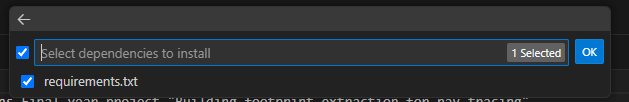

These are the files of Dylan Sheridans Final year project "Building footprint extraction for ray tracing".
The make-gis-friendly.py script is from the Microsoft Building Footprints repository. All data these scripts downloaded is from the Microsoft building footprint dataset which is licensed under the Open Data Commons Open Database License (ODbL).

References
[1] 
make-gis-friendly.py. Microsoft. Accessed: Jan. 28, 2025 [Online]. Available:https://github.com/microsoft/GlobalMLBuildingFootprints/blob/main/scripts/make-gis-friendly.py

## Setup

1. Install Visual Studio Code 

2. Install Python

3. Create a Python environment

4. Select to create a virtual environment (Venv)

5. Select the version of Python you want to use

6. Select Requirements.txt to install necessary dependencies

7. Open a terminal and type in "python scriptname.py" to run a given scripts.
   Eg. "python FinalMergedScript.py"